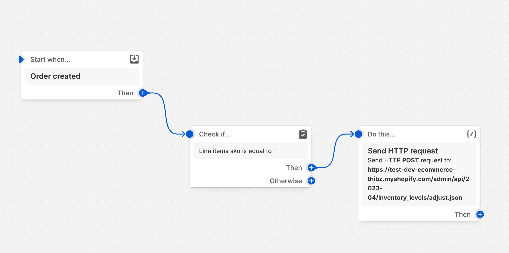

# Shopify Dawn Implementation - Thibault VIGNERON

URL du shop : https://test-dev-ecommerce-thibz.myshopify.com/

Mot de passe : `ungeop`

## Mise en place du projet

### Installation des dépendances

```bash
npm install -g @shopify/cli@latest  # Installation de Shopify CLI
shopify theme init # Initialisation du projet
cd shopify-dawn-implementation # Se déplacer dans le dossier du projet
```

### Création du shop de développement

Pour créer un shop de développement, il faut se rendre sur le site de Shopify et créer un compte. Une fois le compte créé, il faut créer un shop de développement.

### Lancement du projet

```bash
shopify theme dev --store test-dev-ecommerce-thibz # Lancement du shop de développement
```

## Exercice 1

#### 1. Changement du type de panier en "drawer"

Modification du fichier `config/setting_data.json` :

```json
...
{
"cart_type": "drawer",
}
...
```

#### 2. Création d'un nouveau composant pour les promotions

- Création du snippet `cart-drawer-promotions.liquid` et affichage de ce snippet dans le fichier `sections/cart-drawer.liquid`. 


#### 3. Intégration CSS et developpement des fonctionnalités liées aux promotions

- Utilisation de la variable globale `cart` pour afficher la marge restante avant de bénéficier des différentes promotions. 

- Calcul de la différence entre le montant minimum (via des variables) pour bénéficier de la promotion et le montant actuel du panier, puis affichage de cette différence sous forme de texte. 

- Implémentation d'une barre de progrès sous forme de pourcentage en utilisant la même logique que pour le texte, et en utilisant une variable css et un pseudo-element.


#### 4. Mise a jour dynamique du cart-drawer en fonction du prix du panier

- Modification des fichiers `assets/cart-drawer.js` et `snippets/buy-buttons.liquid` du pour créer un événement personnalisé qui se déclenche à chaque fois que le panier est mis à jour.

- Création d'une fonction qui ajoute ou supprime un produit (via un ID prédéfini) au panier en fonction du montant actuel du panier et de la présence ou non du produit. (Utilisation de l'API de Shopify '/cart/add.js' et '/cart/udpate.js')

- Création d'une fonction qui met à jour le DOM du panier en fonction la modification du panier. (Utilisation de l'API de rendering de sections de Shopify '/?section_id=cart-drawer')

- Ajout d'un écouteur d'événement sur le panier pour déclencher la fonction de mise à jour du panier à chaque fois que le panier est mis à jour.

## Exercice 2

#### 1. Accès a shopify Flow
- Allez dans l'admin Shopify, puis dans "Apps > Shopify Flow" et créer un nouveau flux d'automatisation.

#### 2. Ajouts des actions et des déclencheurs
- Déclencheur : "Order Created" (Commande créée), se déclenche lorsque qu'une commande est créée.
- Condition : "La commande contient un article avec SKU = "1".
- Action : "Ajuster les niveaux de stock", décrémenter le stock de 1 pour le produit avec SKU = "1" via une requête HTTP à l'API de Shopify.

- Gestion des stocks insuffisants : Si le stock est inférieur ou égal à 0, envoyer un e-mail à l'administrateur du shop pour l'informer que le stock est épuisé.

#### 3. Documentation

[flow.png](shopifyFlow/flow.png)



- Exemple de requête HTTP pour ajuster le stock :

```json
{
  "order_id": "10006453059907",
  "product_id": "14860849905987",
  "sku": "1",
  "quantity_deducted": 1,
  "remaining_stock": 10,
  "action": "deduct_stock",
}
```

- Gestion des erreurs :

```json
{
  "order_id": "10006453059907",
  "product_id": "14860849905987",
  "sku": "GIFT-SKU-123",
  "quantity_requested": 1,
  "remaining_stock": 0,
  "error": "Insufficient stock",
  "action": "notify_admin",
}
```

### Exercice 3

#### Installation du thème Dawn - Thibault VIGNERON

- Prérequis : Avoir un compte Shopify, un shop de développement et avoir installé Shopify CLI. Également, créer un produit cadeau avec le SKU "1" et comme ID '52831218630979' (Amélioration => création d'un métafields pour choisir le produit).

- Cloner le thème Dawn et lancer le serveur de développement :

```bash
git clone https://github.com/Thibzv/shopify-dawn-implementation.git
cd shopify-dawn-implementation
shopify theme serve --store [nom-du-store]
```

### Exercice 4 : Gestion des promotions et soldes

#### 1. Création d'une collection "Soldes"
- Mise en place d'une collection nommée "Soldes" avec un métafield permettant de définir facilement le pourcentage de promotion applicable.
- Ajout des produits concernés à cette collection.

#### 2. Calcul et affichage des remises
- Modification du fichier `snippets/price.liquid` pour :
  - Calculer automatiquement le prix soldé en fonction du pourcentage défini dans le métafield de la collection.
  - Afficher le prix barré (prix original) et le prix réduit (prix soldé) sur les pages de collection et de produit.
- Utilisation d'une valeur par défaut de 10 % si aucun pourcentage n'est défini dans le métafield.

Ce système permet une gestion dynamique et centralisée des promotions pour les produits appartenant à la collection "Soldes".

#### 3. Affichage du label 
- Ajout d'un "badge" sur les produits ayant la promotion active,
- Modification du fichier `snippets/product-card.liquid` pour afficher le badge en fonction du nom de la collection sur les produits concernés.
- Utilisation des classes CSS déjà présentes dans le thème pour styliser le badge.

#### 4. Passage du prix remisé dans le panier
- Utilisation du même calcul de prix remisé pour l'affichage dans le panier.
- Modification du fichier `snippets/buy-button.liquid` pour passer le prix remisé à l'item du panier dans une propriété `discounted_price`.

#### 5. Affichage du prix remisé dans le panier
- Modification du fichier `snippets/cart-drawer.liquid` et d'une condition pour cacher la propriété `discounted_price` dans la description du produit.

- Utilisation de la propriété `discounted_price` pour afficher le prix remisé dans le panier en modifiant le prix d'un item et en fonction de la quantité.